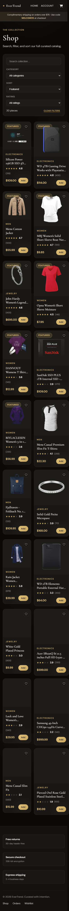

<div align="center">

# EverTrend

**A premium React ecommerce storefront with curated product discovery, cart, and checkout.**

[](https://react.dev/)
[](https://vitejs.dev/)
[](https://reactrouter.com/)
[](https://eslint.org/)
[](https://prettier.io/)
[](https://vercel.com/)

### [Live preview](https://shopping-cart-sage-three.vercel.app/)

</div>

## Demo


<details>
<summary>Screen views</summary>

**Desktop**


**Mobile**



</details>

## Overview

EverTrend is a polished single-page ecommerce experience built with React. It fetches a live product catalog from the [Fake Store API](https://fakestoreapi.com/), layers in local enrichment (variants, reviews, promos), and persists cart, wishlist, and order data in the browser.

Originally created as a [The Odin Project](https://www.theodinproject.com/) learning exercise, the app has since been redesigned into a full storefront with search, filtering, product detail, multi-step checkout, and account-style order history.

## Features

- **Storefront** — Hero landing page, featured products, and category discovery
- **Shop** — Search, category filter, rating filter, and sortable product grid
- **Product detail** — Image gallery, size/color variants, reviews, related products, wishlist
- **Cart** — Quantity controls, promo codes (`WELCOME15`, `LUXE10`), shipping/tax breakdown
- **Checkout** — Three-step flow (shipping → payment → review) with order confirmation
- **Wishlist** — Save and revisit products (persisted locally)
- **Account** — Order history and recently viewed products
- **UX** — Loading skeletons, empty states, responsive layout, reduced-motion support, keyboard focus styles

## Tech stack

| Layer | Tools |
| --- | --- |
| UI | React 18, CSS Modules, design tokens |
| Routing | React Router 6 |
| Build | Vite 5 |
| Data | Fake Store API + cached service layer |
| State | React Context + `useReducer` (cart, wishlist, promos) |
| Persistence | `localStorage` |
| Deploy | Vercel (SPA rewrites) |

## Getting started

### Prerequisites

- [Node.js](https://nodejs.org/) 18+
- npm 9+

### Install and run

```bash
git clone https://github.com/asdacosta/shopping-cart.git
cd shopping-cart
npm install
npm run dev
```

Open [http://localhost:5173](http://localhost:5173).

### Scripts

| Command | Description |
| --- | --- |
| `npm run dev` | Start Vite dev server |
| `npm run build` | Production build to `dist/` |
| `npm run preview` | Serve the production build locally |
| `npm run lint` | Run ESLint |

## Project structure

```text
src/
├── components/
│   ├── cart/          # Cart line items, order summary
│   ├── layout/        # Nav, footer, page shell
│   ├── product/       # Cards, grid, filters, reviews
│   └── ui/            # Buttons, spinners, ratings, etc.
├── context/           # ShopProvider + cart reducer
├── data/              # Product enrichment (variants, reviews, promos)
├── hooks/             # useProducts, useCartTotals
├── pages/             # Route-level screens
├── services/          # productApi (fetch + cache)
├── stylesheets/       # tokens, global, reset
└── utils/             # Filter/sort helpers
```

## Deployment

The app is configured for Vercel with SPA fallback (`vercel.json` rewrites all routes to `index.html`). After `npm run build`, deploy the `dist/` output or connect the repo to Vercel for automatic builds.

## Regenerating README media

With the preview server running (`npm run preview`), capture fresh screenshots and demo GIF:

```bash
# One-time: npm install -D playwright gifenc pngjs && npx playwright install chromium
node scripts/capture-readme-assets.mjs
```

Assets are written to `readme-assets/` (`shop.gif`, `desktop.png`, `mobile.png`).

## Roadmap

- [ ] Add automated tests (unit + e2e)
- [ ] Cart line items linking directly to product pages
- [ ] Manual quantity input on product and cart screens

## Author

[Abraham Da Costa Silvanus](https://github.com/asdacosta)

**[↑ Back to top](#evertrend)**
