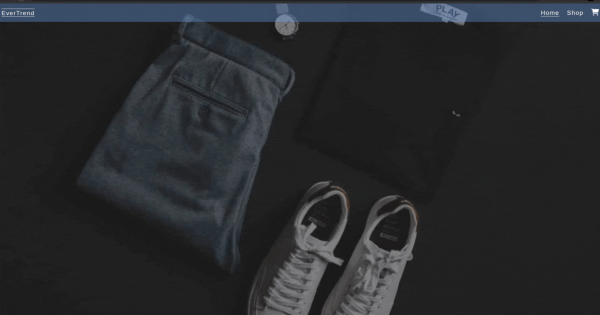
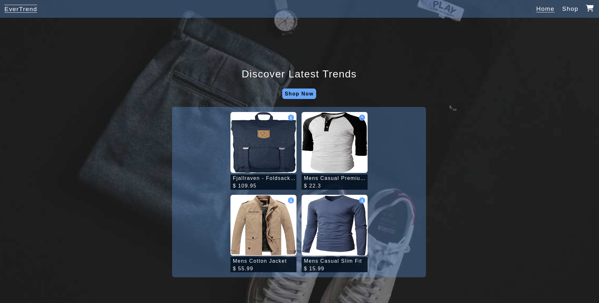
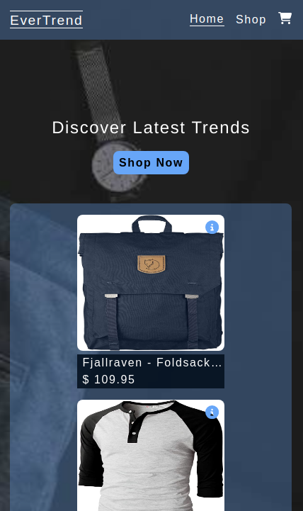

<div align='center'>

# Template

</div>
<div align='center'>
    <h3>💻 Languages</h3>
    
    
    
    <h3>🔧 Technologies</h3>
    
    
    
    
    
    
    
    
    
    
    
    
    <!-- <h4><a href="https://asdacosta.github.io/###/">Live Preview</a></h4> -->
</div>

**Demo:**




<details>

**<summary>Screen views</summary>**

**Desktop View:**


<br>

**Mobile View:**



</details>

## 🌐 Origin

[The Odin Project](https://www.theodinproject.com/)

## 📝 Description

Builds a Shopping Cart.

<details>
<summary>Features</summary>

- No special features

</details>

## 🎯 Relevance

To solidify concepts of `Context API, Router, Fetching Data, Styling` in React.

## 👥 Intended Audience

Developers, users, recruiters.

> [!NOTE]
> Users can install all dependencies using `package.json` file via:
>
> ```bash
> npm install
> ```

## 📂 Files

<details>
<summary>Invert</summary>

| File                                 | Description                                                                                                                                                             |
| ------------------------------------ | ----------------------------------------------------------------------------------------------------------------------------------------------------------------------- |
| `src/*`                              | Source files that are bundled into the output directory `dist/`.                                                                                                        |
| `src/main.jsx`                       | The main JavaScript entry point that bundling begins.                                                                                                                   |
| `src/App.jsx`                        | Main component where overall structure and other layout components of the app are contained.                                                                            |
| `src/assets/*`                       | All assets(imgs, icons, vids) used in website.                                                                                                                          |
| `src/components/Cart.jsx`            | Displays Cart.                                                                                                                                                          |
| `src/components/CartItem.jsx`        | Creates added cart items in `Cart.jsx`.                                                                                                                                 |
| `src/components/ErrorPage.jsx`       | Display error if anything goes wrong.                                                                                                                                   |
| `src/components/ids.jsx`             | Generate unique strings for arrays in `map`.                                                                                                                            |
| `src/components/Item.jsx`            | Creates shop items.                                                                                                                                                     |
| `src/components/ItemHome.jsx`        | Displays shop item details.                                                                                                                                             |
| `src/components/Nav.jsx`             | Display navigation.                                                                                                                                                     |
| `src/components/HomePage.jsx`        | Main home page.                                                                                                                                                         |
| `src/components/routes.jsx`          | Creates routes in `HomePage.jsx`.                                                                                                                                       |
| `src/components/ShopPage.jsx`        | Main shop page.                                                                                                                                                         |
| `src/components/WelcomePage.jsx`     | Displays buyable items at `HomePage.jsx`.                                                                                                                               |
| `src/stylesheet/App.css`             | Stylesheet for `App.jsx`.                                                                                                                                               |
| `src/stylesheet/Cart.module.css`     | Stylesheet for `Cart.jsx` and `CartItem.jsx`.                                                                                                                           |
| `src/stylesheet/HomePage.module.css` | Stylesheet for `HomePage.jsx`.                                                                                                                                          |
| `src/stylesheet/Item.module.css`     | Stylesheet for `Item.jsx`.                                                                                                                                              |
| `src/stylesheet/ItemHome.module.css` | Stylesheet for `ItemHome.jsx`.                                                                                                                                          |
| `src/stylesheet/Nav.module.css`      | Stylesheet for `Nav.jsx`.                                                                                                                                               |
| `src/stylesheet/ShopPage.module.css` | Stylesheet for `ShopPage.jsx`.                                                                                                                                          |
| `src/stylesheet/reset.css`           | ets style to default for consistency across different devices and browsers..                                                                                            |
| `dist/*`                             | Output files from bundling of files in directory `src/`.                                                                                                                |
| `dist/main.js`                       | Main JavaScript output file that contains the bundled JavaScript code. Code is minified and optimized for deployment (Due to mode set to production in webpack config). |
| `package*`                           | Contains details of project and dependencies versions.                                                                                                                  |
| `readme-assets/*`                    | Live demo and different screen views used in `README.md`.                                                                                                               |

</details>

## ©️ Credit

<details>
<summary>Invert</summary>

| File             | Description                                                |
| ---------------- | ---------------------------------------------------------- |
| `src/assets/###` | Photo created by Mnz on [Unsplash](https://unsplash.com/). |

</details>

## 🔄 Improvements

<details>
<summary>Invert</summary>

- [ ] Items in Cart should link to item home.
- [ ] Separate fetching into a solitary file.
- [ ] Refactor functionalities into a solitary class component.
- [ ] Run tests

</details>

## 👤 Curator

1. [Abraham Da Costa Silvanus](https://github.com/asdacosta)

<br>

> [!IMPORTANT]
> Seek contributor's consent for any code usage.

**[🞁 Top](#template)**
